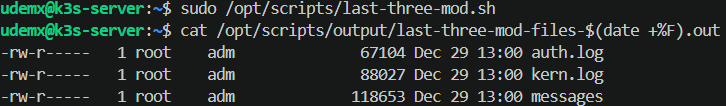
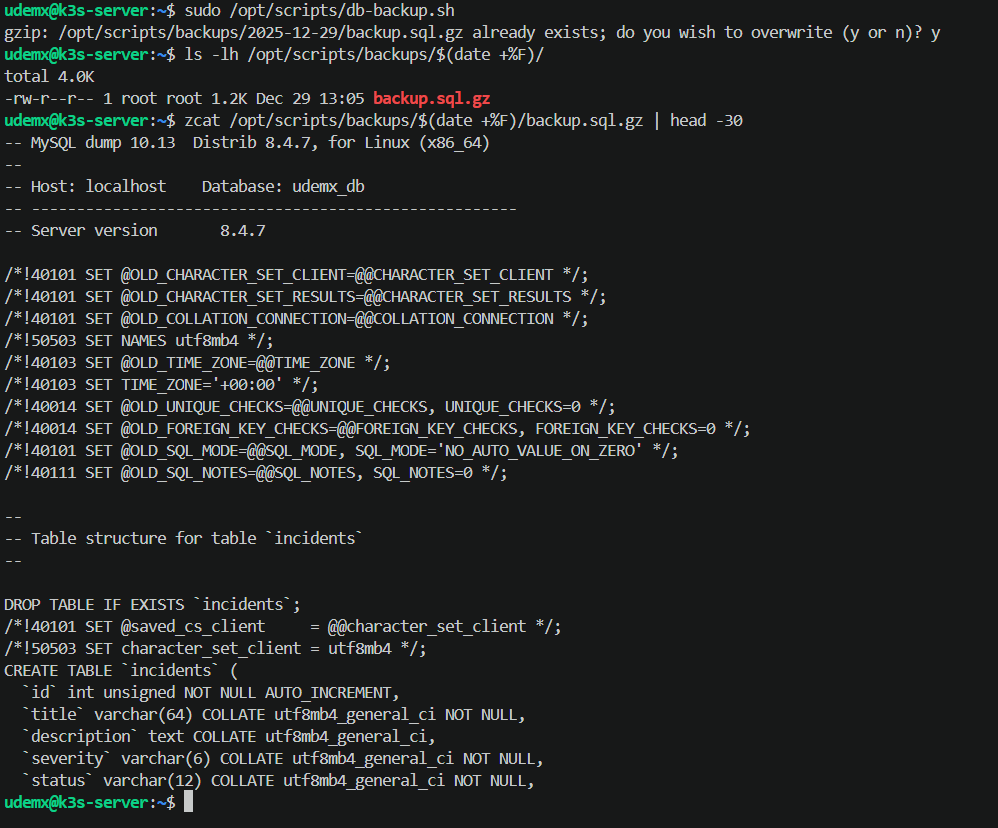
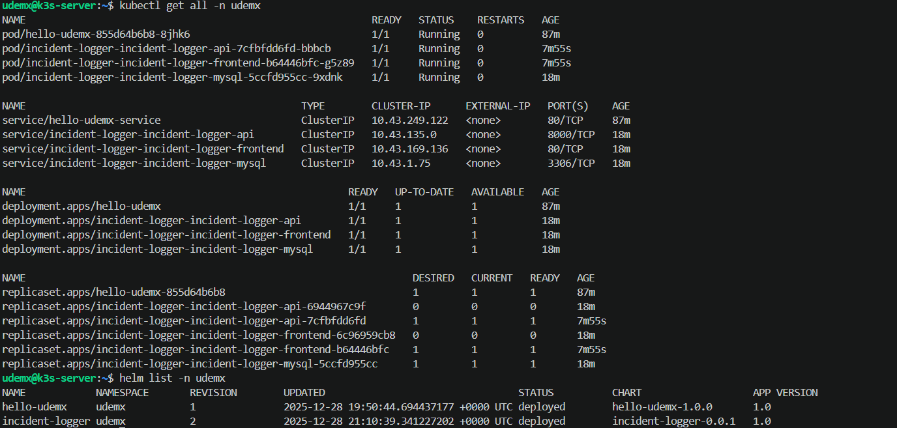
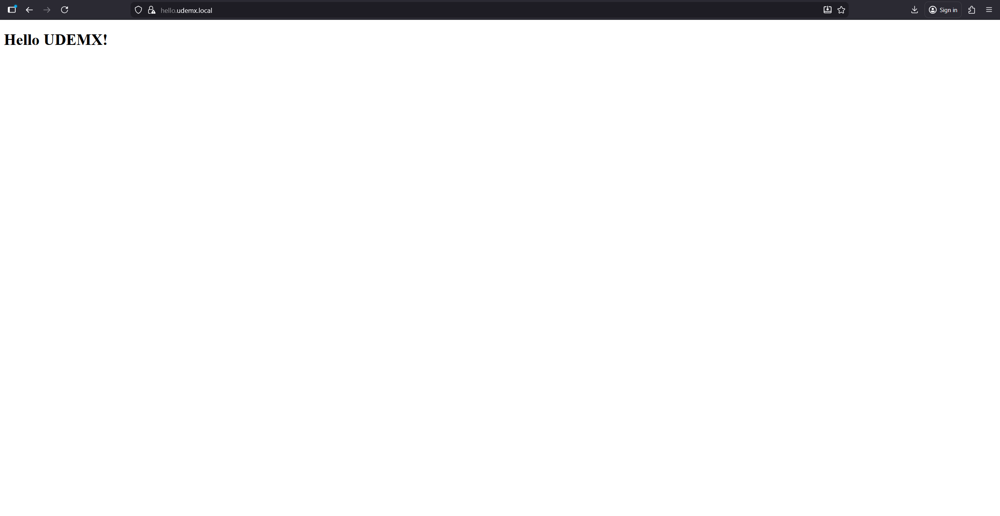
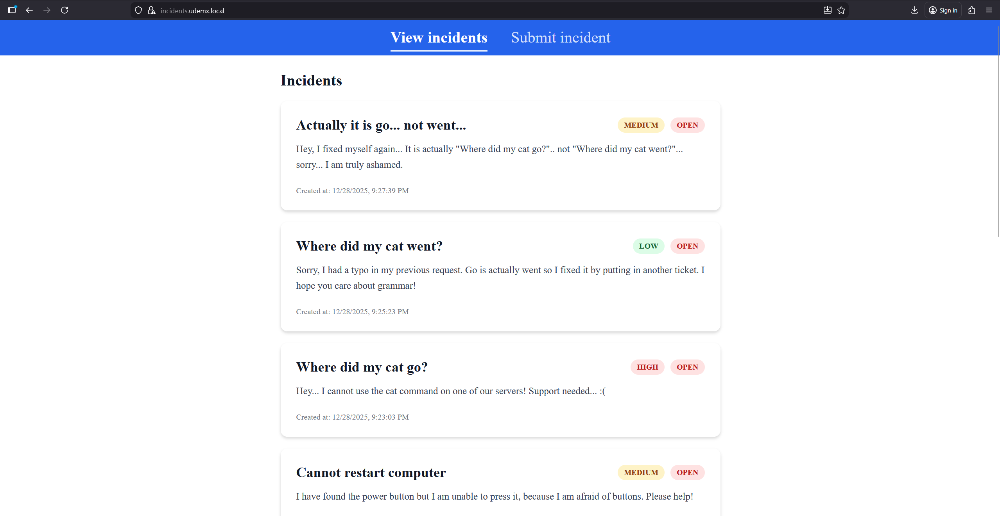

# Platform Automation Lab

This is an automated DevOps infrastructure with Vagrant, Ansible, K3s, and Jenkins. I made this as a take-home assignment and to learn about Ansible, Jenkins and K3s.

## Notes
This application uses a private repository for the main application components and helm charts to show how separation of concerns can be implemented with the tools I used. This public repository only contains the infrastructure built with Vagrant and Ansible and a basic application helm chart which is automatically deployed and shows a simple Hello UDEMX message on the main page.

To fully use this repository you would need the contents of my private application repository. It contains the completed Jenkinsfile, the frontend and backend code with dockerfiles, and the helm chart which can be deployed to the application server.

This application and the infrastructure is just a demo. In production, proper secrets management solutions (ansible vault, etc...) are a must-have. I would also use a better, highly available and scalable database solution in production like Amazon RDS or a similar one from another cloud service providers. I would also implement a multi node, highly available on-prem Kubernetes cluster with redundant power supplies and network connection or a managed kubernetes service like Amazon EKS or similar. Fully serverless solutions are also possible and I have already implemented that with AWS services in my [serverless repository](https://github.com/tiborenyedi96/incident-logger-serverless).

## Prerequisites

- VirtualBox
- Vagrant
- DockerHub account
- Access to the private repository

## Default Credentials

- VM user: `udemx`
- VM sudo password: `Alma1234`
- VM root password: `Alma1234`

## Setup

### 1. Start VMs

```bash
cd vagrant
vagrant up
```

### 2. Configure Jenkins

Wait for VMs to finish provisioning (~10-15 min).

Access Jenkins at http://localhost:8080

Get initial password:
```bash
ssh -i ssh-keys/udemx_jenkins-server -p 2234 udemx@localhost
sudo cat /var/lib/jenkins/secrets/initialAdminPassword
exit
```

- Install suggested plugins
- Create admin user
- Add DockerHub credentials (ID: `dockerhub-credentials`)
- Add GitHub credentials (ID: `github-credentials`)

### 3. Setup SSH key

Get Jenkins public key:
```bash
ssh -i ssh-keys/udemx_jenkins-server -p 2234 udemx@localhost
sudo cat /var/lib/jenkins/.ssh/id_rsa.pub
exit
```

Add to app server:
```bash
ssh -i ssh-keys/udemx_app-server -p 2233 udemx@localhost
echo '<jenkins-public-key>' >> ~/.ssh/authorized_keys
exit
```

### 4. Create DockerHub secret on application server

```bash
ssh -i ssh-keys/udemx_app-server -p 2233 udemx@localhost
kubectl create secret docker-registry dockerhub-secret \
  --docker-server=https://index.docker.io/v1/ \
  --docker-username=YOUR_USERNAME \
  --docker-password=YOUR_DOCKER_ACCESS_TOKEN \
  -n udemx
exit
```

### 5. Update hosts file

Add to hosts file:

```
127.0.0.1    hello.udemx.local
127.0.0.1    incidents.udemx.local
```

### 6. Setup application repo

In the private incident logger repository:
- Copy `Jenkinsfile.example` as `Jenkinsfile`
- Update `DOCKERHUB_USER` and `APP_SERVER_IP`
- Commit and push

### 7. Create Jenkins pipeline

- New Item → Pipeline
- Pipeline from SCM → Git
- Add repo URL and credentials
- Build Now

### 8. Access apps

- Hello UDEMX: https://hello.udemx.local
- Incident Logger: https://incidents.udemx.local

---

## Screenshots

### Monitoring and Backup Scripts


*Cron jobs: MySQL backup runs daily at 2 AM, load monitoring every 15 minutes*


*Load average monitoring output (runs every 15 minutes)*



*Last 3 modified files in /var/log*


*All files modified in the last 5 days*



*MySQL backup script with dump validation*

### CI/CD Pipeline


*Jenkins credentials for DockerHub and GitHub*


*Successful pipeline: Build → Push → Copy Helm Chart → Deploy*


*Jenkins pipeline configuration with GitHub SCM*


*Docker images pushed to registry*

### Running Applications



*All Kubernetes resources (pods, services, deployments, Helm releases)*



*Hello UDEMX app*



*Incident logger - view tickets*


*Incident logger - submit new ticket*
